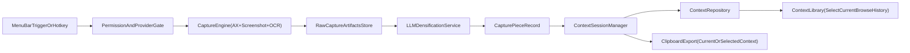

# Context Generator Production V1 Plan

## Scope Lock

- Build against the locked product requirements in `[/Users/semihcihan/development/workspace/context-generator/v1-prd.md](/Users/semihcihan/development/workspace/context-generator/v1-prd.md)` and accepted decisions in `[/Users/semihcihan/development/workspace/context-generator/v1-decision-log.md](/Users/semihcihan/development/workspace/context-generator/v1-decision-log.md)`, with one V1 scope update: no context linking.
- Keep V1 local-first, macOS-only, and provider support limited to OpenAI/Anthropic/Google.
- Use a session-style model:
  - One **current context** at a time.
  - Each capture becomes a **capture piece** appended to current context.
  - User can create a new context, switch current context to any old context, and continue appending there.
  - User can undo last append and promote last capture into a new context.
- Treat the current POC in `[/Users/semihcihan/development/workspace/context-generator/Sources/ContextGeneratorDemo/main.swift](/Users/semihcihan/development/workspace/context-generator/Sources/ContextGeneratorDemo/main.swift)` as the baseline capture prototype to refactor, not as final architecture.

## Delivery Architecture

- Split app logic into a testable core module plus a thin app shell.
- Keep capture as hybrid (`AX first`, `screenshot/OCR fallback`) with observable quality signals.
- Process each capture piece with LLM densification to remove repetitive UI noise while preserving all relevant information.
- Avoid auto-linking entirely in V1.

## Workstreams and Tasks

### 1) Refactor POC into maintainable modules

- Add a core library target and keep executable target focused on app bootstrap/UI wiring in `[/Users/semihcihan/development/workspace/context-generator/Package.swift](/Users/semihcihan/development/workspace/context-generator/Package.swift)`.
- Move models/capture/storage logic out of monolithic `main.swift` into dedicated files under `Sources/ContextGenerator/`.
- Keep behavior parity with current capture before introducing new features.

### 2) Onboarding and permissions gate

- Implement first-run onboarding with up-front Accessibility and Screen Recording permission checks.
- Block capture until permissions are granted and provider config is complete.
- Add explicit privacy messaging: data local by default, provider calls only with user key.

### 3) Context domain and local data layer

- Replace `latest-only` file pattern with persistent context repository (SQLite/SwiftData backed).
- Add V1 entities:
  - `Context`: container with metadata and ordering.
  - `CapturePiece`: raw capture + densified output + source metadata, ordered within a context.
  - `AppState`: selected current context.
- Persist raw capture text, OCR text, source metadata, and densified text.

### 4) Capture reliability hardening (desktop + browsers)

- Add capture strategy policies by source type (native app vs browser app bundle).
- Improve AX traversal resilience and performance bounds (timeouts, node caps, quality scoring).
- Add deterministic fallback path to screenshot/OCR and explicit capture method confidence.

### 5) Provider + Keychain integration

- Add provider abstraction and adapters for OpenAI/Anthropic/Google.
- Store API keys in Keychain only; never in plaintext files.
- Add provider/model validation and health checks in settings.

### 6) Densification pipeline (no linking)

- Run post-capture densification to remove repetitive UI/boilerplate while preserving complete factual content.
- Add deterministic prompt contract for dense, concise output with source fidelity constraints.
- Store both raw and densified outputs per piece so users can inspect and copy either form.

### 7) Context session commands and history workflow

- Implement command layer with unit-testable operations:
  - `createNewContext`
  - `appendCaptureToCurrentContext`
  - `undoLastCaptureInCurrentContext`
  - `promoteLastCaptureToNewContext`
  - `setCurrentContext(existingContextId)`
- Ensure older contexts remain editable by selecting them as current and appending new pieces.

### 8) Context library and export flow

- Add searchable context list with filters (app/date/tag/keyword).
- Support selecting any past context as current.
- Add export/copy for full context (dense by default, raw optional) from menu bar flow.

### 9) Quality, observability, and release readiness

- Add structured logging and diagnostics for capture/densification failures.
- Add unit tests for normalization/dedupe/storage/provider parsing, context command semantics, and densification orchestration.
- Add integration smoke tests for capture paths and persistence round-trips.
- Define and enforce release gates (Alpha -> Beta -> GA) tied to success metrics from PRD.

## Release Gates

- **Alpha:** capture reliability across core target apps/browsers, onboarding complete, no data loss.
- **Beta:** provider integrations stable, densification quality acceptable, median processing time target met.
- **GA:** PRD success thresholds met, privacy/security checks complete, onboarding and failure UX polished.

## Key Files to Implement or Evolve

- Existing: `[/Users/semihcihan/development/workspace/context-generator/Sources/ContextGeneratorDemo/main.swift](/Users/semihcihan/development/workspace/context-generator/Sources/ContextGeneratorDemo/main.swift)`
- Existing: `[/Users/semihcihan/development/workspace/context-generator/Package.swift](/Users/semihcihan/development/workspace/context-generator/Package.swift)`
- New: `[/Users/semihcihan/development/workspace/context-generator/Sources/ContextGenerator/Models/Context.swift](/Users/semihcihan/development/workspace/context-generator/Sources/ContextGenerator/Models/Context.swift)`
- New: `[/Users/semihcihan/development/workspace/context-generator/Sources/ContextGenerator/Models/CapturePiece.swift](/Users/semihcihan/development/workspace/context-generator/Sources/ContextGenerator/Models/CapturePiece.swift)`
- New: `[/Users/semihcihan/development/workspace/context-generator/Sources/ContextGenerator/State/ContextSessionManager.swift](/Users/semihcihan/development/workspace/context-generator/Sources/ContextGenerator/State/ContextSessionManager.swift)`
- New: `[/Users/semihcihan/development/workspace/context-generator/Sources/ContextGenerator/Capture/ContextCaptureService.swift](/Users/semihcihan/development/workspace/context-generator/Sources/ContextGenerator/Capture/ContextCaptureService.swift)`
- New: `[/Users/semihcihan/development/workspace/context-generator/Sources/ContextGenerator/Storage/ContextRepository.swift](/Users/semihcihan/development/workspace/context-generator/Sources/ContextGenerator/Storage/ContextRepository.swift)`
- New: `[/Users/semihcihan/development/workspace/context-generator/Sources/ContextGenerator/Enrichment/DensificationService.swift](/Users/semihcihan/development/workspace/context-generator/Sources/ContextGenerator/Enrichment/DensificationService.swift)`
- New: `[/Users/semihcihan/development/workspace/context-generator/Sources/ContextGenerator/Providers/ProviderClient.swift](/Users/semihcihan/development/workspace/context-generator/Sources/ContextGenerator/Providers/ProviderClient.swift)`
- New: `[/Users/semihcihan/development/workspace/context-generator/Sources/ContextGenerator/Security/KeychainService.swift](/Users/semihcihan/development/workspace/context-generator/Sources/ContextGenerator/Security/KeychainService.swift)`
- New: `[/Users/semihcihan/development/workspace/context-generator/Sources/ContextGeneratorDemo/UI/ContextLibraryController.swift](/Users/semihcihan/development/workspace/context-generator/Sources/ContextGeneratorDemo/UI/ContextLibraryController.swift)`
- New: `[/Users/semihcihan/development/workspace/context-generator/Tests/ContextGeneratorTests/ContextSessionManagerTests.swift](/Users/semihcihan/development/workspace/context-generator/Tests/ContextGeneratorTests/ContextSessionManagerTests.swift)`
- New: `[/Users/semihcihan/development/workspace/context-generator/Tests/ContextGeneratorTests/DensificationServiceTests.swift](/Users/semihcihan/development/workspace/context-generator/Tests/ContextGeneratorTests/DensificationServiceTests.swift)`

## Execution Order (Critical Path)

- Scope lock -> module refactor -> onboarding/permissions -> context domain/storage -> provider/keychain -> densification -> context commands/history -> library/export -> testing and release gates.
- Keep each stage shippable behind feature flags so reliability can be evaluated continuously.
