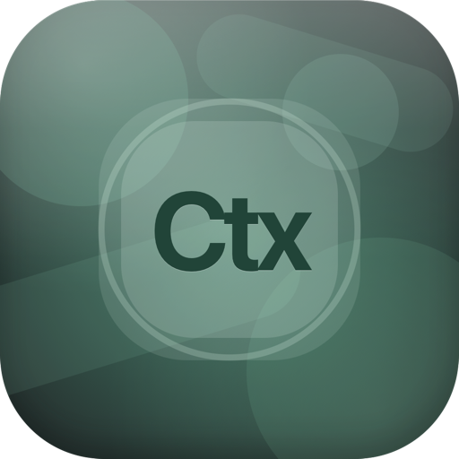

<h1>
  
  Context Brief
</h1>

Context Brief is a macOS menu bar app that captures what you are working on, cleans it up into high-signal context, and keeps it ready to copy into LLMs and coding agents.

## What it does

- Captures context from your frontmost app or browser tab.
- Uses Accessibility first, then screenshot + OCR fallback when needed.
- Densifies captured content with your own provider API key.
- Stores your context history locally on your Mac.
- Lets you keep one current context and keep appending snapshots to it.

## Requirements

- macOS 13 or newer.
- Accessibility permission.
- Screen Recording permission.
- One provider setup:
  - OpenAI
  - Anthropic
  - Google

## Install

### Option 1: Homebrew

```bash
brew install semihcihan/contextbrief/contextbrief
```

### Option 2: DMG

1. Download `ContextBrief.dmg` from the [latest GitHub release](https://github.com/semihcihan/contextbrief/releases/latest).
2. Open the DMG and drag `ContextBrief.app` into `/Applications`.
3. Launch `ContextBrief`.

## First launch setup

1. Grant permissions for capturing context:
   - Accessibility
   - Screen Recording
2. Select your provider.
3. Enter model and API key.
4. Finish setup.

Until setup is complete, capture actions remain blocked.

## Daily usage

- Use menu bar action or shortcut to add a snapshot to the current context.
- Copy current context when you are ready to paste into an LLM or coding agent.
- Create a new context for a new task.
- Open Context Library to switch back to older contexts.

## Data and privacy

- Contexts are stored locally:
  - `~/Library/Application Support/ContextBrief/store.json`
  - `~/Library/Application Support/ContextBrief/artifacts/*.png`
- API keys are stored in macOS Keychain.
- Model requests go only to your selected provider using your key.

## License

MIT
